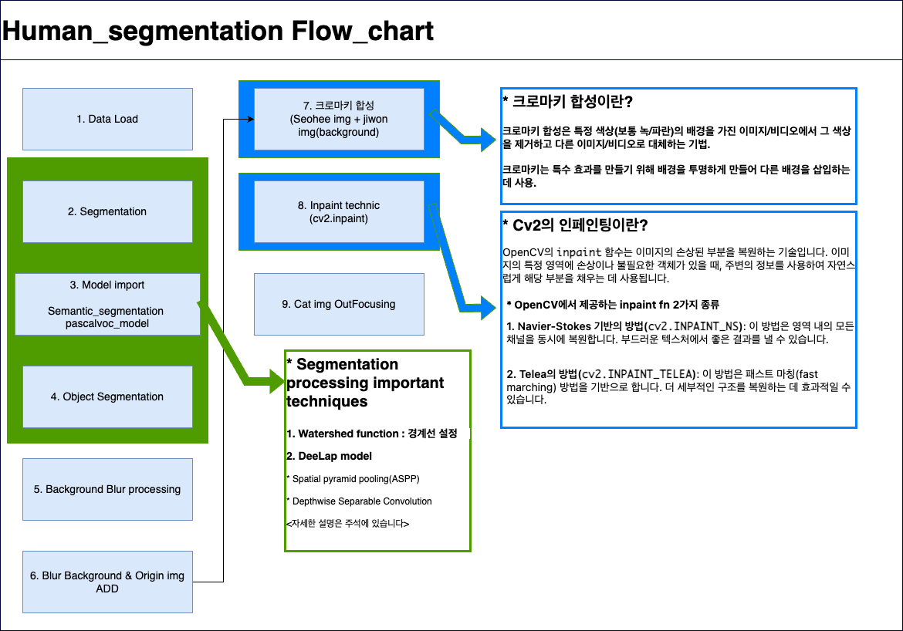

# Report
* Human_segmentation.ipynb 보시면 됩니다!

---
# 프로젝트 평가 루브릭

### 평가문항 상세기준

1. 인물모드 사진을 성공적으로 제작하였다.	아웃포커싱 효과가 적용된 인물모드 사진과 동물 사진, 배경전환 크로마키사진을 각각 1장 이상 성공적으로 제작하였다.

2. 제작한 인물모드 사진들에서 나타나는 문제점을 정확히 지적하였다.	인물사진에서 발생한 문제점을 정확히 지적한 사진을 제출하였다.

3. 인물모드 사진의 문제점을 개선할 수 있는 솔루션을 적절히 제시하였다.	semantic segmentation mask의 오류를 보완할 수 있는 좋은 솔루션을 이유와 함께 제시하였다.

---

## 1. Semantic Segmentation Flow Chart

## 2. Flow step description

step 1. data load
* img_ jiwon, seohee, orig, bg_orig 4개의 이미지 활용 (색상 채널 변경)

### step 2. Segmentation
* Deeplab model 활용, watershed fn 기법 활용

### step 3. Model import
* pascalvoc (Zoo 데이터 훈련된 DeepLab 모델 활용)
* 배열 형태로 분할 된 img 변수 저장 

### step 4. Object Segmentation
* 라벨 종류 확인
* 추출하고자 하는 객체 클래스 확인(Person[15])
* 256가지 서로 다른 색상 Colormap 생성 (R,G,B) (ind 배열로 for문 Shift)
* 컬러맵 생성 순서와 모델이 클래스에 할당하는 색상의 순서는 같다!
* colormap RGB, output BGR 이므로 채널 배치 변경
* seg_map 정의(위 해당 컬러맵과 동일한 색은 1(True),0(False)로 구분
* Seg_map으로 **img_mask 생성(객체 분할)**
### img_mask (객체 255, 외 0) 꼭 기억!
  
step 5. Background Blur processing
* img에 Blur 함수 처리
* 블러처리는 RGB 형식으로 변경(위에선 BGR로 읽어왔음)
* cv2.bitwise로 위에서 분리한 img_mask를 반전 (객체만 0, 배경 255)

step 6. Blur bg & Orig img ADD
* 분리하면서 정의한 마스크들 헷갈리지 않고 concat (np.where)
* Seg이미지(img_mask_color(img_mask 배열 변경)) 255값만 원본, img_원본, ing_bg_blur

step 7. 크로마키
* 위 과정으로 새로운 이미지에서 배경 추출
* Seohee img + jiwon img(배경) 이렇게 합성
* 배열 크기 안 맞는 부분 resize로 잘 확인하면서 변경해줘야 함

step 8. Inpaint function
* 배경 분리할 때 사람이 있어서 검은 공간이 생겨 그 곳을 채워주는 함수 활용 (cv2 내장함수)
* Flow_chart에 자세한 설명 있습니다

step 9. Cat img Outfocusing
* 위 과정 복습으로 Cat class Segmentation 진행 후 블러 처리로 '아웃포커싱'

## 3. 회고록
변수 정의하는 부분이 계속 헷갈렸습니다. RGB 색상 채널의 배치가 변경되는 부분이 있어서 정의한 변수들이 더 헷갈렸던 것 같습니다. 앞으로 더 직관적인 영어로 정의하는 것을 연습하려고 합니다.

컬러맵 형성시 모델에서 할당 받은 색상과 인덱스 순서가 왜 같은지 한참 고민하다가 해결했습니다

크로마키 기술로 합성 했을 때, 배경이미지에서 Seg 된 사람 객체의 빈 공간을 처리하려고 알아보다가 inpaint 함수를 알게되어 적용해보았습니다. 생각해보면 굳이 Seg 안하고 합성해도 원본 사람한테 가려졌습니다..

문제점은 2가지 발견했습니다
1. 크로마키 합성에서 필요한 사람 객체만 분할하는 것이 아니고 원하지 않는 사람도 분할 했습니다
2. my_face.jpeg로 작업 했을 때는 1번과 같은 문제도 있고, 다리를 분할하지 못했습니다

## 4. Segmentation 문제점
* 원하는 사람 객체 외에 사람도 분할

---
* my_face 다리 분할 실패

## 5. 문제점 해결 방안

1. 특정 사람 객체만 분할하고 싶으면 Instance Segmentation을 진행해야 합니다
<과정>
* 객체가 있는 이미지와 해당 객체에 대한 이진분류 되어 있는 mask 정보가 포함된 데이터 셋 준비
* Instance Segmentation model 선택
* Segmentation 시 구분하고 싶은 객체에 대한 고유한 식별자(포즈)를 학습 시켜서 클래스를 세부적으로 구성해야 할 것 같습니다. 고유식별자 다른 것이 있나 알아보는 중입니다!

2. 바지(다리)를 인식 못한 것은 포즈 추정에 실패한 것 같습니다
<해결방안>
* 사람 분할에 좀 더 적합한 pre-trained model을 찾기
  
* 다양한 포즈를 학습 시 일반화 성능 향상을 위해 데이터를 더 수집하거나 Augmentation 진행!
  
* 위 Instance 과정처럼 포즈 추정 알고리즘을 사용하여 포즈를 먼저 검출하고, 포즈 정보를 활용합니다 (포즈마다 해당 사람 클래스, 사람1 클래스, ... 등)
